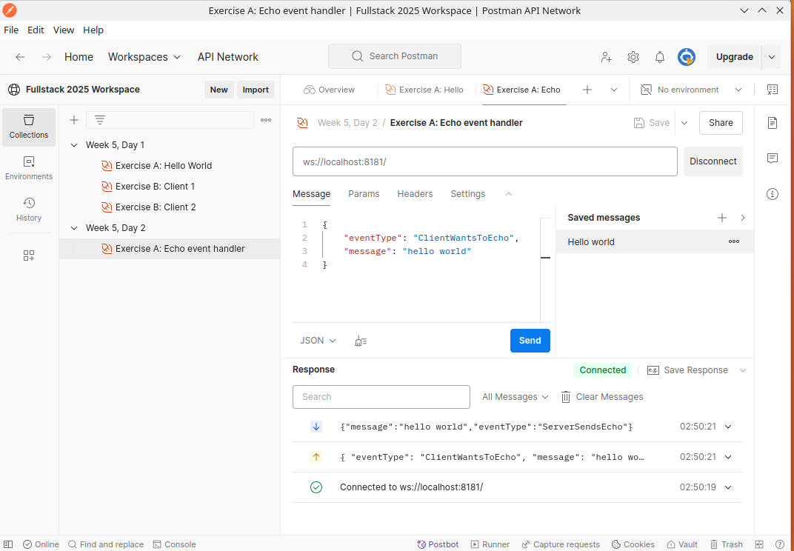

# Server-Side Event Handling

I recommend watching the above **until 13:30** where the Angular client app implementation starts. 

(*We will look at client-implementation next lesson (which will be React-based, so stay tuned for some React WebSocket client material)*)

#### Remote repo for today's lesson with solutions: (https://github.com/uldahlalex/fs25_5_2)

### Agenda

- 08:15: Presentation
- 08:35: Starting exercise A
- 09:15: Wrapping up exercise A and presenting exercise B + How to wrap your head around control flow with websockets
- 09:40: Exercise B + C

### Topics:

- Event Handlers (how to make WebSocket API "endpoints")
- Event driven architecture
- Global Exception handling
- Event filters / pre-event actions
- Simple stateless authentication in event-driven systems

### Exercises

<!-- #region ex A -->

    
Exercise A: Implementing Event Handler

#### Task
The WebSocket API should be able to trigger different server events based on an "eventType" property in the JSON DTO sent to the API.
The goal is: **Send a DTO to the API representing some sort of chat message**. The API must the send a **success message back to the client** AND **broadcast the message to all other clients**.

#### Instructions

I recommend you follow the instructions in this documentation to set up an event handler thus making the API capable of having different "events": [LINK](https://github.com/uldahlalex/uldahlalex.websocket.boilerplate/blob/master/README.md) 

Building the event handlers is based on the today's video material, so if you want a live demo, you can watch the video first.

#### How to test it:

You can test the API with the Postman Desktop client. I have an example WebSocket connection + message in my Fullstack 2025 workspace: https://www.postman.com/uldahlalexteam/fullstack-2025-workspace/ws-raw-request/678e3e5669c951396fd62e94

This should be the result:

<!-- #endregion ex A -->
_________

<!-- #region ex B -->

    
Exercise B: Global Exception Handling

#### Task
Make a global exception handler by wrapping the "CallEventHandler()" method call in a try-catch block. The exception handler should be capable of the following:
- Returning a response DTO to the appropriate client
- Logging relevant details server-side

#### Instructions

*...To be published*

#### How to test it:

*...To be published*

<!-- #endregion ex B -->
_________

<!-- #region ex C -->

    
Exercise C: Using an event-filter / actions before each server-event

### Exercise C is to be published soon...

<!-- #endregion ex C -->

_______

<!-- #region ex D -->

    
Exercise D: Chaining events

### Exercise D is to be published soon...

<!-- #endregion ex D -->
