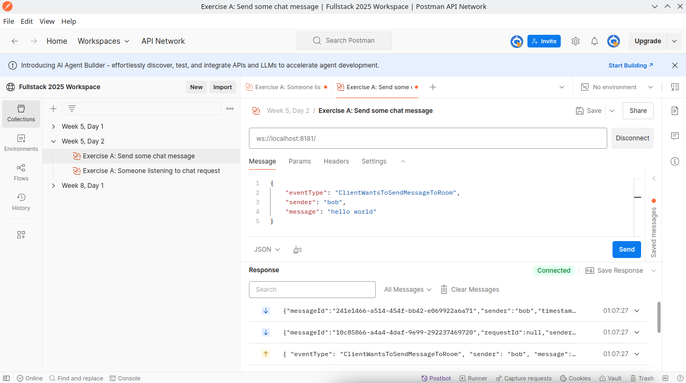
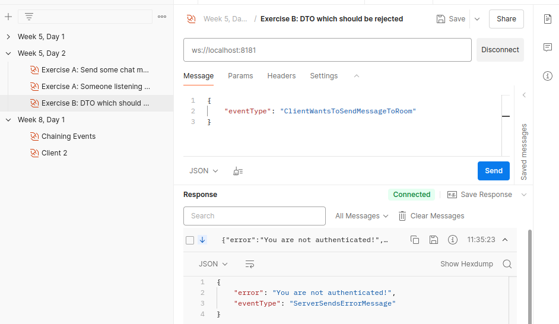
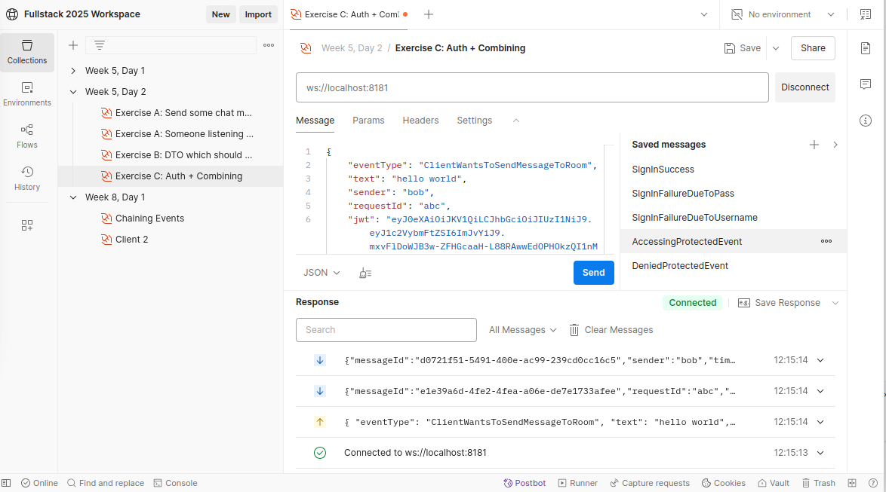

# Server-Side Event Handling

[](https://youtu.be/nKCCoZmV2ls)

I recommend watching the above **until 13:30** where the Angular client app implementation starts. 

(*We will look at client-implementation next lesson (which will be React-based, so stay tuned for some React WebSocket client material)*)

#### Remote repo for today's lesson with solutions: `https://github.com/uldahlalex/fs25_5_2`


### Agenda

- 08:15: Presentation
- 08:40: Starting exercises
- 09:40: Wrapping up exercises & week 6 preview of what's to come next time
- 10:00 -> 11:30: Workshop

### Topics:

- Event Handlers (how to make WebSocket API "endpoints")
- Event driven architecture
- Global Exception handling
- Pre-event actions
- Simple stateless authentication in event-driven systems

### Exercises


<!-- #region ex A -->

<details>
    <summary>Exercise A: Implementing Event Handler</summary>


<div style="margin: 20px; padding: 5px;  box-shadow: 10px 10px 10px grey;">


#### Task
The WebSocket API should be able to trigger different server events based on an "eventType" property in the JSON DTO sent to the API.
The goal is: **Send a DTO to the API representing some sort of chat message**. The API must the send a **success message back to the client** AND **broadcast the message to all other clients**.

#### Instructions

I recommend you follow the instructions in this documentation to set up an event handler thus making the API capable of having different "events": `https://github.com/uldahlalex/uldahlalex.websocket.boilerplate/blob/master/README.md`

Building the event handlers is based on the today's video material, so if you want a live demo, you can watch the video first.

#### How to test it:

You can test the API with the Postman Desktop client. I have an example WebSocket connection + message in my Fullstack 2025 workspace: `https://www.postman.com/uldahlalexteam/fullstack-2025-workspace/ws-raw-request/678e3e5669c951396fd62e94`

This should be the result:



</div>
</details>

<!-- #endregion ex A -->
_________

<!-- #region ex B -->

<details>
    <summary>Exercise B: Global Exception Handling</summary>


<div style="margin: 20px; padding: 5px;  box-shadow: 10px 10px 10px grey;">

#### Task
Make a global exception handler. 
This means **any unhandled exceptions** within event handler methods will be handled by a single exception handler. 

(this is basically just a try-catch block)

#### Instructions

Wrap the "CallEventHandler()" method call in a try-catch block. The exception handler should be capable of the following:
- Returning a response DTO to the appropriate client *(tip: make a class extending BaseDto called ServerSendsErrorMessage for this)*
- Logging relevant details server-side 

The relevant code to make the global exception handling block is:

```cs
//this is inside Program.cs where you set up the WebSocket server and listen for client messges:
    socket.OnMessage = message =>
    {
        Task.Run(async () =>
        {
            try
            {
                await app.CallEventHandler(socket, message);
            }
            catch (Exception e)
            {
                //This is where you build the global exception handling logic
            }
        });
    };
```

#### How to test it:

Try throwing an exception in an event handler to trigger this exception with Postman:



</div>
</details>

<!-- #endregion ex B -->
_________

<!-- #region ex C -->

<details>
    <summary>Exercise C: Protecting events + combining events</summary>


<div style="margin: 20px; padding: 5px;  box-shadow: 10px 10px 10px grey;">


### Task:
It should be possible to use an event to issue a JWT and then verify JWT's in events when we need to authenticate the client

### Instructions:

1. Make an event for issuing a JWT to a client upon valid sign in. Use this file for easy security boilerplate: 

`https://github.com/uldahlalex/fs25_5_2/blob/main/ExerciseCSolution/SecurityService.cs` 

I use this Nuget for JWT in my .csproj file which is required for the above code:

```xml
    <PackageReference Include="JWT" Version="11.0.0" />
```

2. Make an event which is "protected" (a valid JWT is required).
3. If a valid JWT is not attached to the DTO when reaching a "protected event", throw an exception and let the global exception handler do its job

Note: Postman Workspaces have a tendency to remove JWT's because they deem them as "leaked secrets", but this is how it looks when I send a valid dto:



</div>
</details>

<!-- #endregion ex C -->


<!-- #region ex D -->

<details>
    <summary>Exercise D: Make it persist data aswell!</summary>


<div style="margin: 20px; padding: 5px;  box-shadow: 10px 10px 10px grey;">


### Task:
Add connection from your API to a Postgres database (or whatever other RDBMS you want to) with Entity Framework. Make some CRUD operations with Event Handlers.

*(Tip: Connecting to DB is still just "AddDbContext()" inside Program.cs and using your constructor in your event handler to require an instance of your dbcontext - just like last semester)*


</div>
</details>

<!-- #endregion ex D -->


_______

